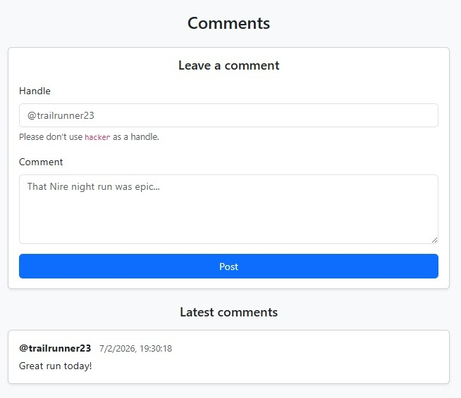
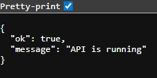
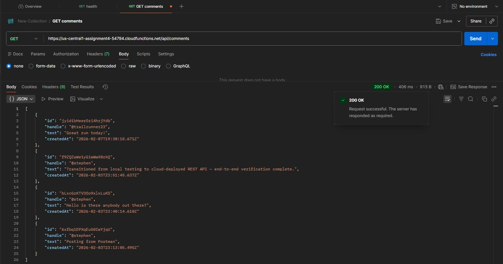
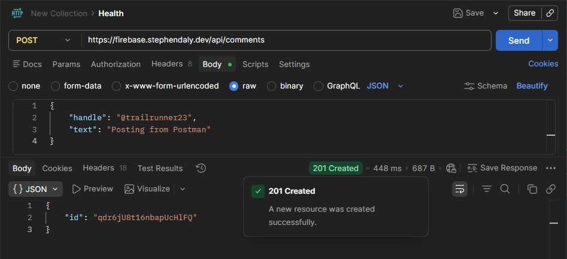

# Firebase Serverless REST API Demo

A small end-to-end demo of a static site on Firebase Hosting calling a serverless REST API (Cloud Functions v2 + Express) that stores comments in Firestore.

> **For reviewers:** Start with **[v1.1.1 – Review Snapshot](https://github.com/sdaly-ie/firebase-serverless-rest-api/releases/tag/v1.1.1)** (stable).  
> The `main` branch may include ongoing updates.
> Initial snapshot: v1.0.0.

## Live Demo
- Website (Firebase Hosting): https://assignment4-54794.web.app/
- API health check: https://us-central1-assignment4-54794.cloudfunctions.net/api/health

> **Note:** A custom domain link is not included here because no custom domain is currently configured for this project.

## What this project shows
- A static website (HTML5/CSS3/JavaScript) deployed with Firebase Hosting
- A serverless REST API built with Cloud Functions v2 and Express
- A Firestore database used to store and load comments
- Basic validation and safe display of user input
- Linting and automated testing, with CI checks in GitHub Actions
- Terraform scaffold for Infrastructure as Code

## Terraform and Infrastructure as Code

The `infra/terraform` folder contains a small Terraform scaffold and a GitHub Actions workflow that runs Terraform format checking and validation.  
It does not provision cloud resources and does not manage Firebase or GCP. It is included as a first Infrastructure as Code iteration.

## REST API (endpoints)

Base URL:
- https://us-central1-assignment4-54794.cloudfunctions.net/api

**Note:** If you open the base URL in a browser, you’ll now see a small JSON response (GET /), which makes it easier to do a quick manual API check.

### `GET /`
Convenience root route for quick browser checks of the API base URL.

Expected response:
```json
{ "ok": true, "message": "Firebase Serverless REST API is running" }
```

### `GET /health`
Quick check that the API is running.

Expected response:
```json
{ "ok": true, "message": "API is running" }
```

### `GET /comments`
Returns the latest comments (newest first).

Example response:
```json
[
  {
    "id": "c4fdZfsbycWuJMTK4Je2",
    "handle": "@stephen",
    "text": "Posting from Postman",
    "createdAt": "2026-02-07T20:20:25.524Z"
  },
  {
    "id": "ZNHt26EtMZPlDnsvPErB",
    "handle": "@stephen",
    "text": "Posting from Postman",
    "createdAt": "2026-02-07T20:08:16.409Z"
  },
  {
    "id": "m8n9SRzA4IcnuT4ZiNwg",
    "handle": "@stephen",
    "text": "Posting from Postman",
    "createdAt": "2026-02-07T20:07:34.227Z"
  },
  {
    "id": "jyidibHeerOri4hrjYdb",
    "handle": "@trailrunner23",
    "text": "Great run today!",
    "createdAt": "2026-02-07T19:30:18.671Z"
  },
  {
    "id": "f9ZQZaWe1yGiwWwX0rkQ",
    "handle": "@stephen",
    "text": "Transitioned from local testing to cloud-deployed REST API and completed end-to-end verification.",
    "createdAt": "2026-02-03T23:51:45.637Z"
  },
  {
    "id": "bLxcGzKTV3Oo9xlxLuKS",
    "handle": "@stephen",
    "text": "Hello is there anybody out there?",
    "createdAt": "2026-02-03T23:40:14.610Z"
  },
  {
    "id": "6xfbq1EPXqEu50IwYjqU",
    "handle": "@stephen",
    "text": "Posting from Postman",
    "createdAt": "2026-02-03T23:13:05.495Z"
  }
]
```

### `POST /comments`
Creates a new comment.

Example request body:
```json
{ "handle": "@trailrunner23", "text": "Great run today!" }
```

After posting a comment, it appears in the Latest comments list (end-to-end check from website to API to Firestore and back to the website).



## Testing the API with Postman

You can test the API directly (without the website) using Postman.

### 1) Health check
- Method: `GET`
- URL: `https://us-central1-assignment4-54794.cloudfunctions.net/api/health`
- Expected: `200 OK` with JSON showing the API is running



### 2) List comments
- Method: `GET`
- URL: `https://us-central1-assignment4-54794.cloudfunctions.net/api/comments`
- Expected: `200 OK` with a JSON list (array) of comments



### 3) Create a comment
- Method: `POST`
- URL: `https://us-central1-assignment4-54794.cloudfunctions.net/api/comments`
- Header: `Content-Type: application/json`
- Body (raw JSON):
```json
{ "handle": "@trailrunner23", "text": "Posting from Postman" }
```
- Expected: `201 Created` with a JSON response containing a new `id`



Quick check: run `GET /comments` again and confirm the new comment appears near the top.

## Basic checks and safety
- Requires both `handle` and `text`
- Blocks the handle `hacker` (checked on the website and again on the API)
- Displays comments as **text**, not as rendered HTML/JavaScript (helps prevent script injection)
- Limits the function to 1 instance (`maxInstances: 1`) to control cost and keep debugging simple

## Tech Stack
- Firebase Hosting
- Firebase Cloud Functions v2 (Node.js) and Express
- Firestore
- HTML / CSS / JavaScript
- ESLint
- Jest + Supertest
- GitHub Actions (CI)
- Dependabot

## Project Structure
- `public/` - website files (HTML/CSS/JS/images)
- `functions/` - API code (Express app deployed as a Cloud Function)
- `functions/__tests__/` - Jest + Supertest API route tests
- `.github/workflows/` - CI workflow(s)
- `.github/dependabot.yml` - dependency update configuration
- `firebase.json` / `.firebaserc` - Firebase project configuration

## Engineering Quality and Local Runbook

This repository includes a platform-readiness upgrade to improve maintainability and reliability without changing the public API contract or breaking public demo links.

### What was added
- Dependabot for npm and GitHub Actions dependency updates
- ESLint for `functions/`
- Jest + Supertest automated tests for core API routes
- GitHub Actions CI with separate lint and test jobs on push and pull request
- Docker-based Functions lint/test workflow (`.github/workflows/docker-functions-ci.yml`)
- Docker support files for local container validation (`functions/Dockerfile`, `functions/.dockerignore`)
- Refactor to extract the Express app into `functions/app.js` for easier testing

### Local quality checks (from repo root)
```bash
cd functions && npm ci && npm run lint && npm test
```

### Local quality checks (from `functions/` folder)
```bash
npm ci
npm run lint
npm test
```

### Docker-based validation (local + CI evidence)

This repository also includes a Docker-based lint/test workflow for the `functions/` service so the same checks can be run in a clean container environment.

**Files added for Docker workflow**
- `functions/Dockerfile`
- `functions/.dockerignore`
- `.github/workflows/docker-functions-ci.yml`

**Build the Functions test image (from repo root, Windows CMD)**
```bash
docker build -t firebase-functions-ci .\functions
```

**Run lint in the container**
```bash
docker run --rm firebase-functions-ci npm run lint
```

**Run tests in the container**
```bash
docker run --rm firebase-functions-ci npm test
```

**Alternative (ad-hoc container check using official Node image + mounted folder, Windows CMD)**
```bash
docker run --rm -v "%cd%\functions:/app" -w /app node:22-alpine sh -lc "npm ci && npm run lint && npm test"
```

This Docker workflow is for validation only (local/CI) and does not replace Firebase deployment (`firebase deploy --only hosting,functions`).

### CI checks (GitHub Actions)
CI runs automatically on:
- pushes to `main`
- pull requests

### Production safety note
Changes are developed and tested on a feature branch before production deployment.

To protect the live demo and public links, the public endpoints are preserved during upgrades:
- `GET /health`
- `GET /comments`
- `POST /comments`

### Troubleshooting
- If lint fails due to missing config, check that `functions/eslint.config.cjs` exists
- If tests fail, confirm `functions/jest.config.cjs` and `functions/__tests__/app.test.js` exist
- If dependencies behave unexpectedly, delete `functions/node_modules` and run `npm ci` again
- Avoid running `npm audit fix --force` during structured upgrade commits unless intentionally planned

### Security (dependency update approach)
Dependabot is enabled; dependency updates are handled via PRs. npm audit fix --force is avoided to prevent breaking changes. Updates are applied incrementally and validated by CI.

## Run locally (Firebase emulators)
Prerequisites: Node.js and Firebase CLI

```bash
cd functions
npm ci
npm run lint
npm test
cd ..
firebase emulators:start --only functions,firestore,hosting
```

## Deploy (Hosting + Functions)
```bash
firebase deploy --only hosting,functions
```

## Why I built this
To practice building, validating, and deploying a small end-to-end cloud application: web user interface, REST API, database and Firebase Hosting/Cloud Functions deployment.
