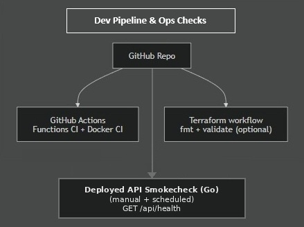
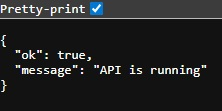
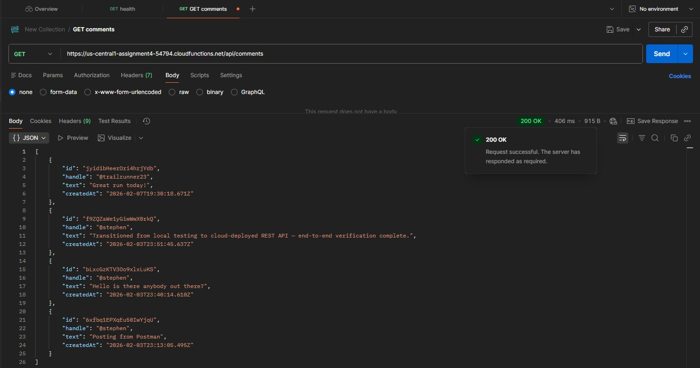

# Firebase Serverless REST API Demo

[](https://github.com/sdaly-ie/firebase-serverless-rest-api/actions/workflows/deployed-smokecheck-go.yml)
[](https://github.com/sdaly-ie/firebase-serverless-rest-api/actions/workflows/functions-ci.yml)
[](https://github.com/sdaly-ie/firebase-serverless-rest-api/actions/workflows/docker-functions-ci.yml)
[](https://github.com/sdaly-ie/firebase-serverless-rest-api/actions/workflows/terraform-validate.yml)

A small end-to-end demo of a static site on Firebase Hosting calling a serverless REST API (Cloud Functions v2 + Express) that stores comments in Firestore.

## Quality gates and automation checks

This repo includes automated verification that the deployed API is healthy and functioning as expected:

- **Deployed API smokecheck (Go)**: runs against the live `/api/health` endpoint as a post-deploy signal.
- **TypeScript API automation (Playwright)**: deployed-endpoint checks in `automation-tests-ts/` covering:
  - `GET /health` (API availability)
  - `POST /comments` + verification via `GET /comments`
  - negative/validation cases

These checks are lightweight, CI-friendly quality signals that demonstrate automation, reliability and delivery discipline.

> **For reviewers:** Start with **[v1.6.0 – Review Snapshot](https://github.com/sdaly-ie/firebase-serverless-rest-api/releases/tag/v1.6.0)** (stable).  
> The `main` branch may include ongoing updates.  
> Initial snapshot: **v1.0.0**.

**What’s new in v1.6.0**
- Added Pact consumer contract tests for:
  - `GET /health`
  - `GET /comments`
  - `POST /comments`
- Added Pact provider verification against the Express app
- Updated `Functions CI` to run both app tests and Pact contract tests

**What’s new in v1.5.0**
- Added TypeScript deployed API automation tests (Playwright) in `automation-tests-ts/`:
  - `GET /health`
  - `POST /comments` + verification via `GET /comments`
  - negative/validation cases
- Documented automation quality gates and how to run the tests in this README
- Tidied Playwright local artifacts via `.gitignore` (removed tracked `test-results/`)

**What’s new in v1.4.0**
- Added CodeQL code scanning (Security → Code scanning alerts)
- Added Dependency Review on pull requests (supply-chain hygiene)
- Added SECURITY.md (reporting guidance) and updated core Firebase deps
- Verified Firebase Emulator Suite locally (Functions + Firestore + Hosting + Emulator UI) using `firebase.json`
- Verified deployed runtime smokecheck after dependency updates

---

## Reviewer quick tour (2–3 minutes)

1) Open the Live demo, submit a comment, and confirm it appears in the list and is retained (demonstrating end-to-end UI -> API -> Firestore -> UI).
2) Hit the **API health check** endpoint (below) and confirm you receive `200 OK`.
3) Open **GitHub Actions -> Deployed API Smokecheck (Go)** to see automated runtime verification of the deployed endpoint:  
   - Workflow: https://github.com/sdaly-ie/firebase-serverless-rest-api/actions/workflows/deployed-smokecheck-go.yml
4) Expand the **Evidence** section below to view screenshots of the GitHub Actions run and the Slack alert.
5) Review `functions/` for API implementation and tests, then `tools/smokecheck-go/` for the Go runtime check.
6) Review `automation-tests-ts/` for TypeScript API automation checks against the deployed endpoint.

---

## Live demo

- **Website (Firebase Hosting):** https://assignment4-54794.web.app/

> UI note: The front-end is intentionally minimal—designed as a lightweight test harness to demonstrate end-to-end data flow and API operation rather than UI/UX polish.

- **API health check:** https://us-central1-assignment4-54794.cloudfunctions.net/api/health

> **Note:** A custom domain is not included because none is currently configured for this project.

---

## Automation / Ops

- **Runtime verification:** a scheduled and manual **Go smokecheck** validates the live `/api/health` endpoint (not just unit tests).
- **Failure visibility:** on smokecheck failure, a **Slack alert** posts to `#ci-alerts` (failure-only, no success spam).
- **CI quality gates:** lint + tests run on pushes and pull requests for `functions/`.

### Evidence

> Evidence screenshots are collapsed by default. Expand the section below to view them.

<details>
<summary><strong>View runtime verification and Slack alert evidence</strong></summary>

**GitHub Actions: deployed smokecheck run**  


**Slack: failure-only alert to #ci-alerts**  


</details>

---

## What this project shows

- Static website (HTML/CSS/JS) deployed with Firebase Hosting
- Serverless REST API built with Cloud Functions v2 (Node.js) + Express
- Firestore database used to store and load comments
- Basic validation and safe display of user input
- GitHub Actions CI (lint + tests), plus Docker-based CI for container parity
- Terraform-managed GCP service enablement, with `fmt`/`validate` checks in CI
- Deployed runtime smokecheck in GitHub Actions (Go) against `/api/health`
- TypeScript deployed API automation checks (Playwright) against the live endpoint (health, comments, negative cases)
- Pact contract tests for consumer/provider API compatibility on `GET /health`, `GET /comments` and `POST /comments`
- CodeQL code scanning + Dependency Review, with Dependabot updates
- Failure-only Slack alerting for deployed smokecheck failures (Incoming Webhook)

---

## Runtime architecture

High-level deployed flow (Hosting -> Functions API -> Firestore):


Dev validation and deployed runtime check overview:



> Ops note: on smokecheck failure, GitHub Actions posts a Slack alert to `#ci-alerts`.

---

## Quick start (local)

**Prerequisites:** Node.js + Firebase CLI (`firebase-tools`)

```bash
cd functions
npm ci
npm run lint
npm test
cd ..
firebase emulators:start
```

This runs the Firebase Emulator Suite locally (Functions + Firestore + Hosting + Emulator UI) using the emulator settings in `firebase.json`.

Verified locally on v1.4.0 using Firebase CLI (`firebase-tools`) v15.8.0 (emulator setup unchanged in v1.5.0).

**If emulators fail to start:** update Firebase CLI to the latest version.

```bash
npm install -g firebase-tools@latest
firebase --version
```

## Run the deployed API automation tests (TypeScript)

Prerequisites:
- Node.js 18+
- A deployed API base URL (example below)

Note: `DEPLOYED_BASE_URL` points to a public demo endpoint used only for automated read/write checks.

From the repo root:

### PowerShell (Windows)
```powershell
cd automation-tests-ts
npm ci
$env:DEPLOYED_BASE_URL="https://us-central1-assignment4-54794.cloudfunctions.net/api"
npx playwright test
```

### Bash (macOS/Linux)
```bash
cd automation-tests-ts
npm ci
export DEPLOYED_BASE_URL="https://us-central1-assignment4-54794.cloudfunctions.net/api"
npx playwright test
```

---

## Project structure

- [`public/`](public/) — website files (HTML/CSS/JS/images)
- [`functions/`](functions/) — API code (Express app deployed as a Cloud Function)
- [`functions/__tests__/`](functions/__tests__/) — Jest + Supertest API route tests
- [`automation-tests-ts/`](automation-tests-ts/) — TypeScript Playwright deployed API automation checks
- [`tools/smokecheck-go/`](tools/smokecheck-go/) — Go tool for deployed `/api/health` smokecheck
- [`infra/terraform/`](infra/terraform/) — Terraform for core GCP service enablement (fmt/validate in CI)
- [`.github/workflows/`](.github/workflows/) — CI + ops workflows
- [`.github/dependabot.yml`](.github/dependabot.yml) — dependency update configuration
- `firebase.json` / `.firebaserc` — Firebase project configuration

---

## CI / Ops workflows (GitHub Actions)

- **Functions CI:** lint + tests on push and pull requests
- **Docker Functions CI:** lint + tests in a container (push and pull requests)
- **Terraform (fmt & validate):** formatting check + validation for `infra/terraform`
- **Deployed API Smokecheck (Go):** manual and scheduled runtime check of live `/api/health` (not run on pull requests)

### Required GitHub Actions secrets

These are stored in **Repo -> Settings -> Secrets and variables -> Actions**.

- `DEPLOYED_HEALTH_URL` — deployed `/api/health` endpoint URL
- `SLACK_WEBHOOK_URL` — Slack Incoming Webhook for `#ci-alerts`

---

## REST API

**Base URL:**  
- https://us-central1-assignment4-54794.cloudfunctions.net/api

> If you open the base URL in a browser, you’ll see a small JSON response (`GET /`), which makes manual checks quicker.

### `GET /`
Convenience root route for quick browser checks.

Expected response:
```json
{ "ok": true, "message": "Firebase Serverless REST API is running" }
```

### `GET /health`
Quick check that the API is running.

Expected response:
```json
{ "ok": true, "message": "API is running" }
```

### `GET /comments`
Returns the latest comments (newest first).

<details>
<summary>Example response</summary>

```json
[
  {
    "id": "c4fdZfsbycWuJMTK4Je2",
    "handle": "@stephen",
    "text": "Posting from Postman",
    "createdAt": "2026-02-07T20:20:25.524Z"
  }
]
```
</details>

### `POST /comments`
Creates a new comment.

Example request body:
```json
{ "handle": "@trailrunner23", "text": "Great run today!" }
```

After posting a comment, it appears in the Latest comments list (end-to-end check from website -> API -> Firestore -> website).


---

## Testing the API with Postman

You can test the API directly (without the website) using Postman.

### 1) Health check
- Method: `GET`
- URL: `https://us-central1-assignment4-54794.cloudfunctions.net/api/health`
- Expected: `200 OK` with JSON showing the API is running



### 2) List comments
- Method: `GET`
- URL: `https://us-central1-assignment4-54794.cloudfunctions.net/api/comments`
- Expected: `200 OK` with a JSON list (array) of comments



### 3) Create a comment
- Method: `POST`
- URL: `https://us-central1-assignment4-54794.cloudfunctions.net/api/comments`
- Header: `Content-Type: application/json`
- Body (raw JSON):
```json
{ "handle": "@trailrunner23", "text": "Posting from Postman" }
```
- Expected: `201 Created` with a JSON response containing a new `id`


Quick check: run `GET /comments` again and confirm the new comment appears near the top.

---

## Basic checks and safety

- Requires both `handle` and `text`
- Blocks the handle `hacker` (validated on the website and again on the API)
- Displays comments as **text**, not rendered HTML/JavaScript (helps prevent script injection)
- Limits the function to 1 instance (`maxInstances: 1`) to control cost and keep debugging simple

---

## Terraform and Infrastructure as Code

The `infra/terraform` folder contains a small Terraform implementation and a GitHub Actions workflow that runs Terraform format checking and validation.
It currently manages a narrow Infrastructure-as-Code slice by enabling core GCP project services that support the Firebase serverless application, while app deployment and broader Firebase configuration remain outside Terraform.

---

## Tech stack

- Firebase Hosting
- Firebase Cloud Functions v2 (Node.js) + Express
- Firestore
- HTML / CSS / JavaScript (minimal UI harness)

## Tooling & Ops

- GitHub Actions (CI + scheduled smokechecks)
- Playwright (TypeScript) deployed API automation checks (`automation-tests-ts/`)
- Jest + Supertest (Functions route tests)
- ESLint
- Docker (CI container parity)
- Go (deployed smokecheck tool)
- Terraform (GCP service enablement + fmt/validate)
- CodeQL code scanning + Dependency Review
- Dependabot (dependency updates)
- Slack (failure alerts via Incoming Webhook)

---

## Deploy (Hosting + Functions)

```bash
firebase deploy --only hosting,functions
```

---

## Why I built this

To practice building, validating and deploying a small end-to-end cloud application (UI, REST API, database, Firebase Hosting/Cloud Functions).

Also to demonstrate production-minded practices: CI lint/tests, container parity checks, Terraform-managed GCP service enablement with validation, deployed runtime smokechecks, and lightweight deployed-endpoint API automation checks (Playwright) with clear run instructions.
