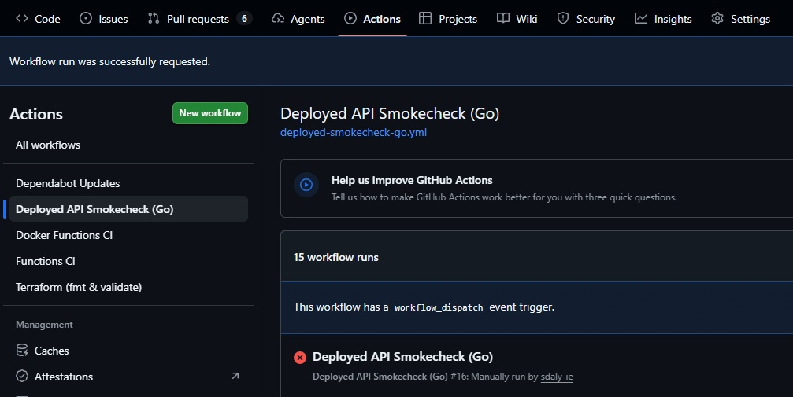
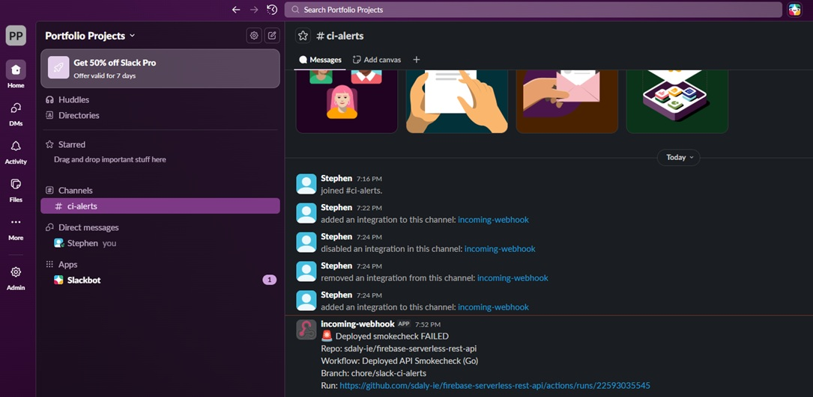
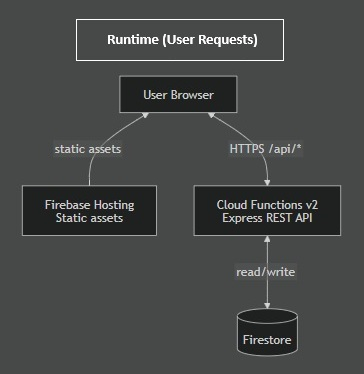
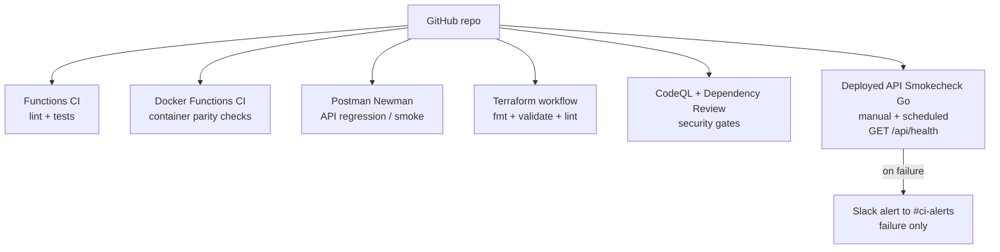
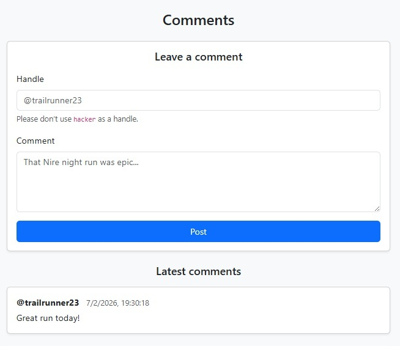
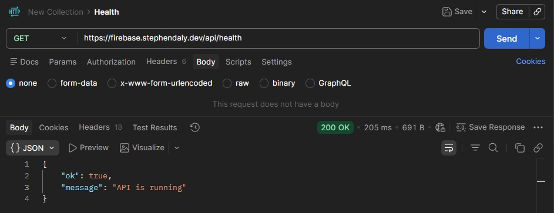
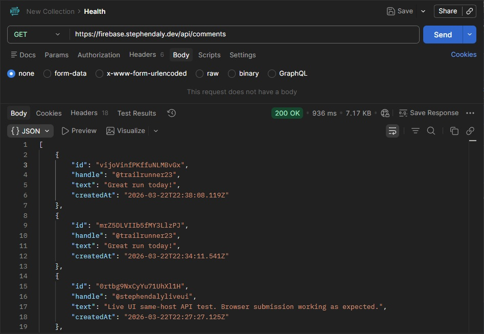
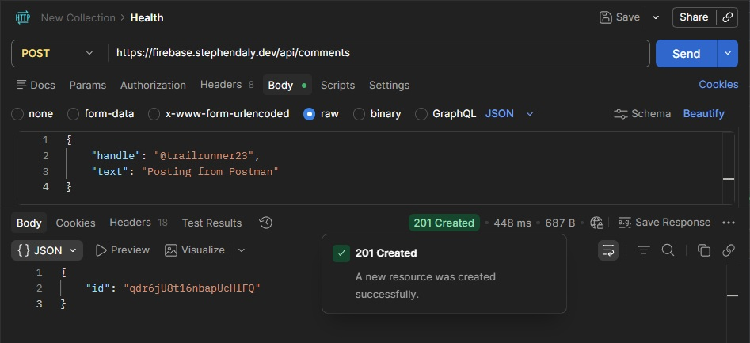

# Firebase Serverless REST API Demo

[](https://github.com/sdaly-ie/firebase-serverless-rest-api/actions/workflows/deployed-smokecheck-go.yml)
[](https://github.com/sdaly-ie/firebase-serverless-rest-api/actions/workflows/functions-ci.yml)
[](https://github.com/sdaly-ie/firebase-serverless-rest-api/actions/workflows/docker-functions-ci.yml)
[](https://github.com/sdaly-ie/firebase-serverless-rest-api/actions/workflows/terraform-validate.yml)

A small end-to-end demo of a static site on Firebase Hosting calling a serverless REST API (Cloud Functions v2 + Express) that stores comments in Firestore.

## Quality gates and automation checks

This repo is designed to show more than a basic Firebase demo. It demonstrates a small deployed cloud application with live runtime verification, multiple automated API assurance layers, a narrow but real Infrastructure as Code (IaC) slice, and practical security/dependency hygiene.

> **For reviewers:** Start with **[v1.15.0 – Review Snapshot](https://github.com/sdaly-ie/firebase-serverless-rest-api/releases/tag/v1.15.0)** (stable).
> The `main` branch may include ongoing updates.
> Initial snapshot: **v1.0.0**.

## Key reviewer links

- **[Review snapshot](https://github.com/sdaly-ie/firebase-serverless-rest-api/releases/tag/v1.15.0)**
- **[Live demo](https://firebase.stephendaly.dev/)**
- **[Swagger UI](https://firebase.stephendaly.dev/swagger/)**
- **[OpenAPI YAML](https://firebase.stephendaly.dev/openapi/openapi.yaml)**
- **[API health check](https://firebase.stephendaly.dev/api/health)**
- **[Go deployed smokecheck workflow](https://github.com/sdaly-ie/firebase-serverless-rest-api/actions/workflows/deployed-smokecheck-go.yml)**

> Reviewer tip: GitHub README links open in the same tab. Use Ctrl+click on Windows or Cmd+click on macOS to open reviewer links in a new tab.

## What this repo demonstrates

- A deployed end-to-end Firebase application using Hosting, Cloud Functions v2, and Firestore
- API documentation and contract visibility through OpenAPI and Swagger UI
- Multiple automated verification layers including Jest, Pact, Playwright, Newman, and a Go deployed smokecheck
- Basic Infrastructure as Code and CI/CD-oriented project hygiene
- Security-minded practices including CodeQL, Dependency Review, Dependabot, controlled CORS configuration, and failure-only Slack alerts

## What's new in v1.15.0

- **Security remediation:** resolved the post-`v1.14.0` Dependabot findings affecting `js-yaml`, `websocket-driver`, `axios`, `body-parser`, `brace-expansion`, and `protobufjs`. The dependency alert page returned to **0 open alerts** after the merged fixes. ([#124](https://github.com/sdaly-ie/firebase-serverless-rest-api/pull/124), [#125](https://github.com/sdaly-ie/firebase-serverless-rest-api/pull/125), [#132](https://github.com/sdaly-ie/firebase-serverless-rest-api/pull/132), [#133](https://github.com/sdaly-ie/firebase-serverless-rest-api/pull/133), [#135](https://github.com/sdaly-ie/firebase-serverless-rest-api/pull/135))
- **Functions runtime and test tooling:** updated `firebase-functions` to `7.3.0`, `express-rate-limit` to `8.6.1`, Pact to `17.0.1`, and ESLint to `10.7.0`. ([#116](https://github.com/sdaly-ie/firebase-serverless-rest-api/pull/116), [#118](https://github.com/sdaly-ie/firebase-serverless-rest-api/pull/118), [#121](https://github.com/sdaly-ie/firebase-serverless-rest-api/pull/121), [#129](https://github.com/sdaly-ie/firebase-serverless-rest-api/pull/129), [#130](https://github.com/sdaly-ie/firebase-serverless-rest-api/pull/130))
- **TypeScript API automation:** updated Playwright from `1.61.0` to `1.62.0`, TypeScript from `6.0.3` to `7.0.2`, and `@types/node` from `25.3.3` to `25.9.5`. ([#117](https://github.com/sdaly-ie/firebase-serverless-rest-api/pull/117), [#119](https://github.com/sdaly-ie/firebase-serverless-rest-api/pull/119), [#122](https://github.com/sdaly-ie/firebase-serverless-rest-api/pull/122), [#123](https://github.com/sdaly-ie/firebase-serverless-rest-api/pull/123), [#134](https://github.com/sdaly-ie/firebase-serverless-rest-api/pull/134))
- **GitHub Actions maintenance:** updated `actions/setup-node` from v6 to v7, `actions/setup-go` from v6 to v7, and `slackapi/slack-github-action` from v3 to v4. ([#126](https://github.com/sdaly-ie/firebase-serverless-rest-api/pull/126), [#127](https://github.com/sdaly-ie/firebase-serverless-rest-api/pull/127), [#128](https://github.com/sdaly-ie/firebase-serverless-rest-api/pull/128))
- Re-ran dependency installation, ESLint, Jest, Pact, Playwright, Docker, Newman, CodeQL, Dependency Review, and deployed Go smokecheck validation as applicable.
- Updated the reviewer links and release summary for `v1.15.0`. No application endpoints, API behaviour, OpenAPI contract, Firestore configuration, or Terraform implementation changed.

<details>
<summary><strong>Previous release highlights</strong></summary>

- **v1.14.0** – Added version-specific npm lifecycle-script approvals and weekly Dependabot coverage for the TypeScript Playwright project; updated Playwright to `1.61.0`, TypeScript to `6.0.3`, `actions/checkout` to v7, and Newman to `6.2.2`; remediated the reported `protobufjs` and `@babel/core` findings; and refreshed the stable reviewer snapshot.
- **v1.13.0** – Completed a broad Dependabot maintenance pass across runtime dependencies, transitive packages, developer tooling, and GitHub Actions security components; updated `firebase-admin`, `express-rate-limit`, ESLint, Pact, Jest, and `firebase-functions-test`; upgraded `actions/dependency-review-action` from v4 to v5; cleared the remaining open Dependabot alert; and refreshed the stable reviewer snapshot.
- **v1.12.0** – Cleared the open Dependabot vulnerability alerts affecting `/functions` dependencies by merging the `axios` and `follow-redirects` updates, merged routine dependency maintenance updates for `firebase-functions` and `firebase-admin`, re-verified that Dependabot vulnerability alerts showed 0 open after the updates, re-verified recent `main` branch GitHub Actions workflow runs passed, and refreshed the README reviewer path and release summary.
- **v1.11.0** – Added rate limiting to `POST /comments` and `/api/comments` using `express-rate-limit`, added automated test coverage for `429 Too Many Requests`, tracked and deployed deny-all `firestore.rules` for client access, corrected Firebase project mapping to `assignment4-54794`, merged dependency maintenance updates for `firebase-functions`, `eslint`, and `lodash`, and re-verified the live site, comment posting flow, and `/api/health`.
- **v1.10.2** – Cleared the open Dependabot security alerts affecting `/functions` dependencies, merged dependency maintenance updates for `path-to-regexp`, `brace-expansion`, and `picomatch`, re-verified that Dependabot vulnerability alerts show 0 open at release time, re-verified that Dependabot malware alerts show 0 open at release time, re-verified that Code scanning alerts show 0 open at release time, re-verified that Secret scanning alerts show 0 open at release time, and updated the Postman Newman workflow to use `actions/checkout@v6` and `actions/setup-node@v6`.
- **v1.10.1** – Fixed Firebase Hosting custom-domain rewrites for `/api` and `/api/*`, re-verified the live custom-domain API responses, and refreshed reviewer setup notes for Node.js 22, first-run Playwright, and opening README links in a new tab.
- **v1.10.0** – Added a custom-domain reviewer path under `firebase.stephendaly.dev`, added same-host API routing under `/api/*`, switched the front-end comments UI to the same-host `/api` path, updated the hosted OpenAPI production server, added a front-end `Load more` control, removed placeholder copyright text from the footer, and refreshed reviewer links and Postman evidence references.
- **v1.9.1** – Cleared open Dependabot security alerts, refreshed reviewer documentation, updated operational evidence, and re-verified the deployed API.
- **v1.9.0** – Added Cloud Logging and Cloud Monitoring to the Terraform service set, added TFLint to the Terraform workflow, added Terraform outputs for project ID and region, removed unused Terraform variables, tightened Terraform documentation, and kept Terraform intentionally narrow in scope.
- **v1.8.1** – Aligned the OpenAPI comment contract, corrected the `POST /comments` response, improved the reviewer path, corrected the Terraform default region, and applied a safe dependency refresh.
- **v1.8.0** – Added OpenAPI 3.0, Swagger UI, Postman collection, Postman environment, and a Newman GitHub Actions workflow.
- **v1.7.0** – Hardened the Go smokecheck, added unit tests, enforced `gofmt` / `go vet` / `go test`, and tightened CORS with an allowlist.
- **v1.6.1** – Replaced the old Terraform placeholder with real GCP service enablement.
- **v1.6.0** – Added Pact consumer and provider contract tests.
- **v1.5.0** – Added TypeScript Playwright deployed API automation checks.
- **v1.4.0** – Added CodeQL, Dependency Review, `SECURITY.md`, and dependency hygiene updates.
- **v1.3.1** – Improved reviewer path, evidence callout, and local quick start.
- **v1.3.0** – Strengthened the review snapshot with better reviewer flow and clearer operational evidence.
- **v1.2.0** – Added the deployed API smokecheck workflow and architecture/pipeline diagrams.
- **v1.1.1** – Fixed review snapshot wording for consistency.
- **v1.1.0** – Added the Terraform scaffold with CI format and validation checks.
- **v1.0.0** – Created the initial stable review snapshot for the live Firebase Hosting + Cloud Functions + Firestore demo.

</details>

---

## Reviewer quick tour (2-3 minutes)

1. Open the **Live demo** and submit a comment to verify the full flow from UI -> API -> Firestore -> UI.
2. Open **Swagger UI** to inspect the live API contract and try the endpoints interactively.
3. Open the **Go smokecheck workflow** to see automated runtime verification of the live deployment.
4. Review the **Evidence** section below for the GitHub Actions smokecheck run and the Slack failure alert.
5. Open the **OpenAPI YAML** directly if you want the raw contract file used by Swagger UI.
6. Hit the **API health check** endpoint and confirm you receive `200 OK`.
7. Review `functions/` for API implementation and tests, then `tools/smokecheck-go/` for the Go runtime check.
8. Review `automation-tests-ts/` for TypeScript API automation checks against the deployed endpoint.

---

## Live demo

- **Website (Firebase Hosting):** <https://firebase.stephendaly.dev/>
- **Swagger UI (live):** <https://firebase.stephendaly.dev/swagger/>
- **OpenAPI YAML (live):** <https://firebase.stephendaly.dev/openapi/openapi.yaml>
- **API health check:** <https://firebase.stephendaly.dev/api/health>

> UI note: The front-end is intentionally minimal and acts as a lightweight test harness to demonstrate end-to-end data flow and API operation rather than UI/UX polish.
> UI note: The comments section now shows the first 5 comments initially and reveals more with a `Load more` button to keep the page readable.
> Docs note: Swagger UI and the hosted OpenAPI YAML are included so reviewers can validate the API quickly without needing to inspect the repo first.
> Custom domain note: the deployed public reviewer path now uses `firebase.stephendaly.dev`, with the API served under the same host via `/api/*`.

---

## Automation / Ops

- **Functions verification:** Node.js 22 CI uses `actions/setup-node@v7` to run clean dependency installation, ESLint, Jest route tests, and Pact consumer/provider contract tests.
- **Container parity:** Docker CI repeats the Functions lint and Jest tests inside the repository’s Node.js 22 Alpine test image.
- **Runtime verification:** a daily and manually dispatchable Go 1.26 smokecheck uses `actions/setup-go@v7` to validate the deployed `/api/health` endpoint.
- **Go workflow quality gates:** the smokecheck runs `gofmt`, `go vet`, and `go test` before executing the deployed runtime check.
- **API regression:** the Newman workflow uses `actions/setup-node@v7`, Node.js 20, and pinned Newman `6.2.2` to run the Postman collection.
- **Security gates:** CodeQL scans JavaScript/TypeScript on pushes, pull requests, and a weekly schedule; Dependency Review checks dependency changes on every pull request.
- **Failure visibility:** on smokecheck failure, a **Slack alert** posts to `#ci-alerts` through `slackapi/slack-github-action@v4` (failure-only, no success spam).

### Evidence

Screenshots of the live smokecheck workflow and failure-only Slack alert.

| Live smokecheck run | Slack failure alert |
| --- | --- |
| [](public/images/ops-actions-smokecheck.jpg) | [](public/images/ops-slack-alert.jpg) |

> Click either image to open the full-size version.

---

## Runtime architecture

High-level deployed flow (Hosting -> Functions API -> Firestore):



Dev validation and deployed runtime check overview:


```mermaid
flowchart TD
    A[GitHub repo]

    B[Functions CI<br/>lint + tests]
    C[Docker Functions CI<br/>container parity checks]
    D[Postman Newman<br/>API regression / smoke]
    E[Terraform workflow<br/>fmt + validate + lint]
    F[CodeQL + Dependency Review<br/>security gates]
    G[Deployed API Smokecheck Go<br/>manual + scheduled<br/>GET /api/health]
    H[Slack alert to #ci-alerts<br/>failure only]

    A --> B
    A --> C
    A --> D
    A --> E
    A --> F
    A --> G
    G -->|on failure| H
```

> Ops note: on smokecheck failure, GitHub Actions posts a Slack alert to `#ci-alerts`.

---

## Quick start (local)

**Prerequisites:** Node.js 22 + Firebase CLI (`firebase-tools`)

```bash
cd functions
npm ci
npm run lint
npm test
npm run test:pact
cd ..
firebase emulators:start
```

> Supply-chain note: both npm projects include explicit, version-pinned lifecycle-script
> approvals. With a compatible npm version, verify either dependency tree using
> `npm ci --strict-allow-scripts` from `functions/` or `automation-tests-ts/`.

This runs the Firebase Emulator Suite locally (Functions + Firestore + Hosting + Emulator UI) using the emulator settings in `firebase.json`.

Local URLs after startup:

- Hosting: `http://127.0.0.1:5000`
- Emulator UI: `http://127.0.0.1:4000`

**If emulators fail to start:** update Firebase CLI to the latest version.

```bash
npm install -g firebase-tools@latest
firebase --version
```

## Run the deployed API automation tests (TypeScript)

Prerequisites:

- Node.js 22 recommended
- A deployed API base URL (example below)

Note:

- `DEPLOYED_BASE_URL` points to a public demo endpoint used only for automated read/write checks.
- On a fresh machine, if Playwright browsers are missing, run `npx playwright install`.

From the repo root:

### PowerShell (Windows)

```powershell
cd automation-tests-ts
npm ci
npx tsc --noEmit
$env:DEPLOYED_BASE_URL="https://firebase.stephendaly.dev/api"
npx playwright test
Remove-Item Env:DEPLOYED_BASE_URL
```

### Bash (macOS/Linux)

```bash
cd automation-tests-ts
npm ci
npx tsc --noEmit
export DEPLOYED_BASE_URL="https://firebase.stephendaly.dev/api"
npx playwright test
unset DEPLOYED_BASE_URL
```

---

## Project structure

- [`public/`](public/) — website files (HTML/CSS/JS/images)
- [`functions/`](functions/) — API code (Express app deployed as a Cloud Function)
- [`functions/__tests__/`](functions/__tests__/) — Jest + Supertest API route tests
- [`automation-tests-ts/`](automation-tests-ts/) — TypeScript Playwright deployed API automation checks
- [`postman/`](postman/) — Postman collection and environment used by the Newman workflow
- [`tools/smokecheck-go/`](tools/smokecheck-go/) — Go tool for deployed `/api/health` smokecheck
- [`infra/terraform/`](infra/terraform/) — Terraform for core GCP service enablement (fmt/validate/lint in CI)
- [`.github/workflows/`](.github/workflows/) — CI + ops workflows
- [`.github/dependabot.yml`](.github/dependabot.yml) — weekly dependency monitoring for Functions, TypeScript Playwright automation, and GitHub Actions
- [`SECURITY.md`](SECURITY.md) — supported-version and vulnerability-reporting guidance
- [`firestore.rules`](firestore.rules) — deny-all direct client access to Firestore
- `firebase.json` / `.firebaserc` — Firebase project configuration

---

## CI / Ops workflows (GitHub Actions)

| Workflow | Trigger | Validation and maintained baseline |
| --- | --- | --- |
| **Functions CI** | Pushes to `main`/`feature/platform-readiness`; all pull requests | Node.js 22 through `actions/setup-node@v7`; `npm ci`; ESLint; Jest route tests; Pact consumer and provider tests |
| **Docker Functions CI** | Pushes to `main`/`chore/docker-ci`; all pull requests | Builds the Node.js 22 Alpine Functions image and runs ESLint plus Jest inside the container |
| **CodeQL** | Pushes and pull requests to `main`; weekly schedule | JavaScript/TypeScript analysis through `github/codeql-action@v4` |
| **Dependency Review** | All pull requests | Dependency-diff policy gate through `actions/dependency-review-action@v5` |
| **Terraform (fmt, validate & lint)** | Changes under `infra/terraform/` or its workflow | Terraform `1.6.6` through `hashicorp/setup-terraform@v4`; formatting, validation, and TFLint through `terraform-linters/setup-tflint@v6` |
| **Deployed API Smokecheck (Go)** | Daily schedule; manual dispatch | Go `1.26.0` through `actions/setup-go@v7`; `gofmt`, `go vet`, `go test`, deployed `/api/health`, and failure-only Slack notification |
| **Postman Newman API Checks** | Pushes and pull requests to `main`; manual dispatch | Node.js 20 through `actions/setup-node@v7`; Newman `6.2.2`; Postman API regression collection |

### Required GitHub Actions secrets

These are stored in **Repo -> Settings -> Secrets and variables -> Actions**.

- `DEPLOYED_HEALTH_URL` — deployed `/api/health` endpoint URL
- `SLACK_WEBHOOK_URL` — Slack Incoming Webhook for `#ci-alerts`

---

## REST API

**Base URL:** <https://firebase.stephendaly.dev/api>

> If you open the base URL in a browser, you’ll see a small JSON response (`GET /`), which makes manual checks quicker.

### `GET /`

Convenience root route for quick browser checks.

Expected response:

```json
{ "ok": true, "message": "Firebase Serverless REST API is running" }
```

### `GET /health`

Quick check that the API is running.

Expected response:

```json
{ "ok": true, "message": "API is running" }
```

### `GET /comments`

Returns up to the latest 50 comments (newest first).

<details>
<summary>Example response</summary>

```json
[
  {
    "id": "c4fdZfsbycWuJMTK4Je2",
    "handle": "@stephen",
    "text": "Posting from Postman",
    "createdAt": "2026-02-07T20:20:25.524Z"
  }
]
```

</details>

### `POST /comments`

Creates a new comment.

Example request body:

```json
{ "handle": "@trailrunner23", "text": "Great run today!" }
```

After posting a comment, it appears in the Latest comments list (end-to-end check from website -> API -> Firestore -> website).

Comment creation is limited to 10 submissions per client within a 15-minute window. Further submissions receive `429 Too Many Requests` until the window resets.



---

## API contract and verification

This repo includes an OpenAPI 3.0 specification and Swagger UI for the deployed API.

### Files

- OpenAPI spec: `public/openapi/openapi.yaml`
- Swagger UI: `public/swagger/index.html`
- Postman collection: `postman/firebase-serverless-rest-api.postman_collection.json`
- Postman environment: `postman/firebase-serverless-rest-api.postman_environment.json`
- Newman workflow: `.github/workflows/postman-newman.yml`

### Test layer separation

- OpenAPI and Swagger: API contract and interactive documentation
- Postman and Newman: reviewer-friendly API regression and smoke checks
- Playwright: deployed endpoint automation
- Pact: consumer and provider contract verification
- Go smokecheck: lightweight live health verification

## Testing the API with Postman

You can test the API directly (without the website) using Postman.

### 1) Health check

- Method: `GET`
- URL: `https://firebase.stephendaly.dev/api/health`
- Expected: `200 OK` with JSON showing the API is running



### 2) List comments

- Method: `GET`
- URL: `https://firebase.stephendaly.dev/api/comments`
- Expected: `200 OK` with a JSON list (array) of comments



### 3) Create a comment

- Method: `POST`
- URL: `https://firebase.stephendaly.dev/api/comments`
- Header: `Content-Type: application/json`
- Body (raw JSON):

```json
{ "handle": "@trailrunner23", "text": "Posting from Postman" }
```

- Expected: `201 Created` with a JSON response containing a new `id`



Quick check: run `GET /comments` again and confirm the new comment appears near the top.

---

## Validation and safety checks

- Requires both `handle` and `text`
- Blocks the handle `hacker` (validated on the website and again on the API)
- Displays comments as **text**, not rendered HTML/JavaScript (helps prevent script injection)
- Restricts cross-origin requests to approved deployed, preview, and local front-end origins
- Rate-limits comment creation to 10 requests per 15-minute window and returns a tested `429` response when exceeded
- Uses tracked deny-all `firestore.rules` to prevent direct client reads and writes; the server-side Admin SDK performs API-controlled access
- Limits the function to 1 instance (`maxInstances: 1`) to control cost and keep debugging simple

---

## Terraform and Infrastructure as Code

The `infra/terraform` folder contains a deliberately narrow Terraform implementation for this repo.

It manages a small project-level Infrastructure as Code (IaC) slice by enabling core GCP services that support the Firebase serverless application, including Artifact Registry, Cloud Build, Cloud Functions, Firestore, Cloud Logging, Cloud Monitoring, and Cloud Run.

A dedicated GitHub Actions workflow checks this Terraform with:

- `terraform fmt -check -recursive`
- `terraform init -backend=false -input=false`
- `terraform validate -no-color`
- `tflint --format compact`

This Terraform does **not** manage:

- Firebase Hosting deployment
- Cloud Functions code deployment
- Firestore rules or indexes
- secrets management
- full environment provisioning

Those areas remain outside Terraform in this repo by design.

---

## Tech stack and validated versions

### Application runtime

- Firebase Hosting
- Firebase Cloud Functions v2 on Node.js 22
- `firebase-functions` `7.3.0` and `firebase-admin` `13.10.0`
- Express `5.2.1`, `cors` `2.8.6`, and `express-rate-limit` `8.6.1`
- Firestore
- HTML / CSS / JavaScript (minimal UI harness)

### API and verification

- OpenAPI 3.0.3
- Swagger UI
- Jest `30.4.2`, Supertest `7.2.2`, and `firebase-functions-test` `3.5.0`
- Pact `17.0.1` consumer and provider contract verification
- Playwright `1.62.0` with TypeScript `7.0.2` and `@types/node` `25.9.5`
- ESLint `10.7.0`
- Postman with Newman `6.2.2`
- Go `1.26.0` deployed smokecheck

### Infrastructure and automation

- Terraform `1.6.6`
- TFLint
- GitHub Actions using `actions/checkout@v7`, `actions/setup-node@v7`, and `actions/setup-go@v7`
- Slack failure alerts using `slackapi/slack-github-action@v4`
- CodeQL using `github/codeql-action@v4`
- Dependency Review using `actions/dependency-review-action@v5`
- Weekly Dependabot monitoring for both npm projects and GitHub Actions

---

## Deploy (Hosting + Functions)

```bash
firebase deploy --only hosting,functions
```

---

## Why I built this

To practice building, validating and deploying a small end-to-end cloud application (UI, REST API, database, Firebase Hosting/Cloud Functions).

Also to demonstrate production-minded practices: CI lint/tests, container-based parity checks, Terraform-managed GCP service enablement with fmt, validate and lint checks, deployed runtime smokechecks, and deployed-endpoint API automation checks (Playwright) with clear run instructions.
